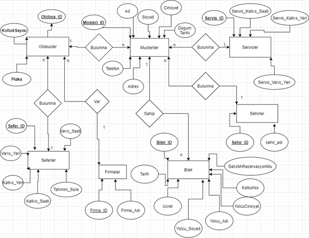
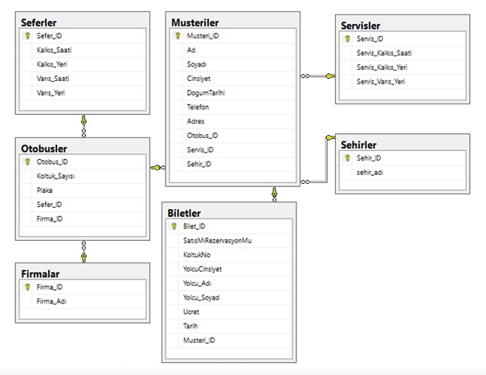

# ENDÜSTRİ MÜHENDİSLİĞİ VERİTABANI YÖNETİMİ C GRUBU ÖRGÜN ÖĞRETİM OTOBUS BİLET SATIŞ VE REZERVASYON SİSTEMİ

## Hazırlayan                                            ***Mehmet Ali YILMAZ***

Oluşturulacak otobüs bilet satış ve rezervasyon sisteminin ihtiyaçları
1.	Firmalar
2.	Otobüsler
3.	Servisler
4.	Seferler
5.	Müşteriler
6.	Biletler
7.	Şehirler
olmak üzere 7 farklı sistem tablosuna ihtiyacımız olacaktır. Firmalara bağlı otobüsler her firmanın farklı veya aynı yöne olan seferleri ve bu seferlerde bulunmak isteyen müşteriler bilet aracılığı ile bu seferlere dahil olacaktır. Müşterilerin otogar ve bulunduğu mahalleler arasında ulaşımını sağlayacağı servisler konulmuştur. Eğer firmalar biletlerini hangi şehirden kimlerin alacağını bilmek ister ve onlara göre farklı çalışma yapabilir diye müşterilerin bulunmuş olduğu şehirlerde sisteme entegre edilmiştir. 

## E-R ŞEMASI

## E-R DİAGRAMI

## Database Oluşturma Kullanma, Tablo Oluşturma, Birincil ve Yabancı Anahtar ilişkilendirme Kodları

### Otobus-Bilet Database

*create database Otobus_Bilet*
*use Otobus_Bilet*

*create table Otobusler(*
*Otobus_ID int IDENTITY(1,1) NOT NULL,*
*Koltuk_Sayısı int not null,*
*Plaka nvarchar(50) not null,*
*Sefer_ID int not null,*
*Firma_ID int not null,*
*constraint PK_Otobusler primary key clustered (Otobus_ID))*

*alter table Otobusler add constraint FK_Otubusler_Seferler foreign key(Sefer_ID)*
*references Seferler(Sefer_ID)*

*alter table Otobusler add constraint FK_Otubusler_Firmalar foreign key(Firma_ID)*
*references Firmalar(Firma_ID)*

### Seferler Database

*create table Seferler(*
*Sefer_ID int IDENTITY (1,1) NOT NULL,*
*Varıs_Saati time(7) null,*
*Tahmini_Süre time(7) not null,*
*Kalkıs_Saati time(7) not null,*
*Kalkıs_Yeri nvarchar(50) not null,*
*BiletTutarı int not null,*
*constraint PK_Seferler primary key clustered(Sefer_ID))*

### Musteriler

*create table Musteriler(*
*Musteri_ID int identity(1,1) not null,*
*Ad nvarchar(50) not null,*
*Soyadı nvarchar(50) not null,*
*Cinsiyet nvarchar(50) not null,*
*DogumTarihi date not null,*
*Telefon nvarchar(50) not null,*
*Adres nvarchar(50) null,*
*Otobus_ID int not null,*
*Servis_ID int not null,*
*Sehir_ID int not null,*
*constraint PK_Musteriler primary key clustered(Musteri_ID))*

*ALTER TABLE Musteriler ADD  CONSTRAINT  FK_Musteriler_Sehirler FOREIGN KEY(Sehir_ID )*
*REFERENCES Sehirler(Sehir_ID)*

*ALTER TABLE Musteriler ADD  CONSTRAINT  FK_Musteriler_Otobusler FOREIGN KEY(Otobus_ID )*
*REFERENCES Otobusler(Otobus_ID)*

*ALTER TABLE Musteriler ADD  CONSTRAINT  FK_Musteriler_Servisler FOREIGN KEY(Servis_ID )*
*REFERENCES Servisler(Servis_ID)*

### Biletler

*create table Biletler(*
*Bilet_ID int identity (1,1) not null,*
*SatısMıRezervasyonMu nvarchar(50) not null,*
*KoltukNo int not null,*
*YolcuCinsiyet nvarchar(50) not null,*
*Yolcu_Adı nvarchar(50) not null,*
*Yolcu_Soyad nvarchar(50) not null,*
*Ucret int not null,*
*Tarih date not null,*
*Musteri_ID int not null,*
*constraint PK_Biletler primary key clustered(Bilet_ID))*

*alter table Biletler ADD CONSTRAINT FK_Biletler_Musteriler FOREIGN KEY(Musteri_ID)*
*REFERENCES Musteriler(Musteri_ID)*

### Servisler

*create table Servisler(*
*Servis_ID int identity (1,1) not null,*
*Servis_Kalkıs_Saati time not null,*
*Servis_Kalkıs_Yeri nvarchar(50) not null,*
*Servis_Varıs_Yeri nvarchar(50) not null,*
*constraint PK_Servisler primary key clustered(Servis_ID))*

### Firmalar 

*create table Firmalar(*
*Firma_ID int identity (1,1) not null,*
*Firma_Adı nvarchar(50) not null,*
*constraint PK_Markalar primary key clustered (Firma_ID))*

### Sehirler

*create table Sehirler(*
*Sehir_ID int identity (1,1) not null,*
*sehir_adı nvarchar(50) not null,*
*constraint PK_Sehirler primary key clustered(Sehir_ID))*

